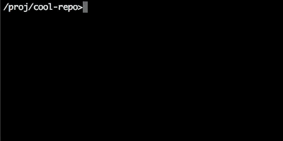

# GitX

GitX is an extension to git that simplifies common workflows.

## Commands

#### git x checkout

Do you need to switch branches, but forgot your branch name? ```git x checkout```
helps you interactively find your branch.

Branches are listed in the order of most-recently-used. Type search terms
to narrow down the list. Use arrow keys to select the right branch, then 
press Enter to switch to it.



#### git x state save / git x state load

Context switching has become easier. These commands upgrade
```git stash``` by saving your entire repo's state instead of
only saving the staged changes. These are guaranteed to 
succeed, unlike stash which fails when conflicts exist.

When you run ```git x state save```, all your staged, unstaged, and untracked
changes are saved to a stash, giving you a completely clean working tree.

When you run ```git x state load```, your repo will switch back to the
original branch (or commit) that it was on when you saved the state. Then
all of your staged, unstaged, and untracked changes will be loaded.

Your repo's state will be exactly the same as you left it.

#### git x pull

Did you try ```git pull``` but it failed due to a conflict with your
unstaged files? ```git x pull``` will always succeed even when you have 
unstaged/untracked changes. If automatic merge fails, you will still have to 
manually fix any merge conflicts.

#### git x merge-latest \<branch\>

This merges the latest version of a branch into your current branch.
Unlike ```git merge <branch>```, you will get the latest commits even
if your local copy is behind the remote.

#### git x undo

Committed too soon? This will undo the last commit and move all of the changes into
the staging area.

#### git x checkout-latest \<branch\>

This checks-out the latest version of a branch even if your local copy is
behind the remote.


## Prerequisites

Node.js must be installed. Probably version 7.6 or higher.

Requires git v1.7 or higher.

## Installing

TODO: need some sort of automatic installation

After pulling the repo, install the dependencies:
```
npm install
```

Next, set up an alias to GitX:
```
# mac/linux
git config --global alias.x '!node /path/to/gitx/src/index'

# windows cmd
git config --global alias.x "!node /c/path/to/gitx/src/index"

# git bash on windows using MinTTY terminal (it's the default terminal for newer git installations)
git config --global alias.x "!winpty node /c/path/to/gitx/src/index"
```

Then run a command:
```
git x checkout
```

## Running the tests

```
npm run test
```

## License

This project is licensed under the MIT License
